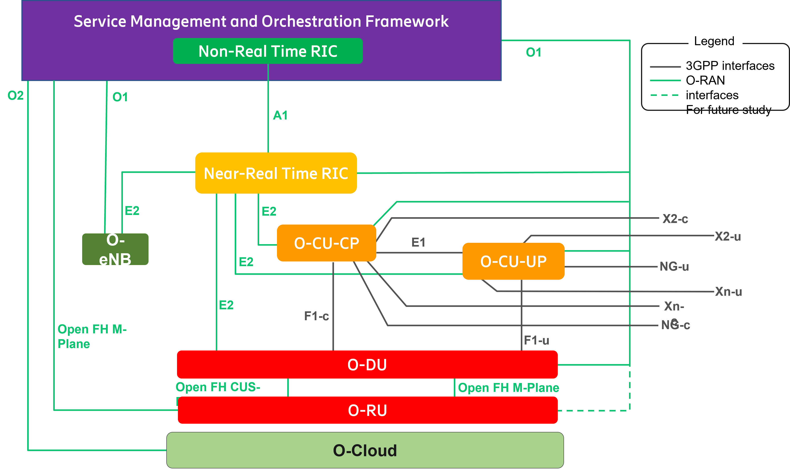

.. This work is licensed under a Creative Commons Attribution 4.0 International License.
.. SPDX-License-Identifier: CC-BY-4.0
.. Copyright (C) 2019 CMCC 

O-RAN Architecture Overview
===========================
O-RAN SC architecture follows O-RAN Alliance defined architecture.

Figure 1: O-RAN architecture overview

In the O-RAN architecture, the radio side includes Near-RT RIC, O-CU-CP, O-CU-UP, O-DU, and O-RU. The management side includes Service Management and Orchestration Framework that contains a Non-RT-RIC function. 

Components Definition
---------------------
For the purposes of the present document, the terms and definitions given in 3GPP TR 21.905 [1] and the following apply. A term defined in the present document takes precedence over the definition of the same term, if any, in 3GPP TR 21.905 [1].

near-RT RIC: O-RAN near-real-time RAN Intelligent Controller: a logical function that enables near-real-time control and optimization of O-RAN elements and resources via fine-grained data collection and actions over E2 interface.

non-RT RIC: O-RAN non-real-time RAN Intelligent Controller: a logical function that enables non-real-time control and optimization of RAN elements and resources, AI/ML workflow including model training and updates, and policy-based guidance of applications/features in near-RT RIC.

NMS: A Network Management System 

O-CU: O-RAN Central Unit: a logical node hosting RRC, SDAP and PDCP protocols

O-CU-CP: O-RAN Central Unit – Control Plane: a logical node hosting the RRC and the control plane part of the PDCP protocol

O-CU-UP: O-RAN Central Unit – User Plane: a logical node hosting the user plane part of the PDCP protocol and the SDAP protocol

O-DU: O-RAN Distributed Unit: a logical node hosting RLC/MAC/High-PHY layers based on a lower layer functional split.

O-RU: O-RAN Radio Unit: a logical node hosting Low-PHY layer and RF processing based on a lower layer functional split.  This is similar to 3GPP’s “TRP” or “RRH” but more specific in including the Low-PHY layer (FFT/iFFT, PRACH extraction).  

O1: Interface between management entities in Service Management and Orchestration Framework and O-RAN managed elements, for operation and management, by which FCAPS management, Software management, File management shall be achieved. 

O1*: Interface between Service Management and Orchestration Framework and Infrastructure Management Framework supporting O-RAN virtual network functions.

xAPP: Independent software plug-in to the Near-RT RIC platform to provide functional extensibility to the RAN by third parties.

