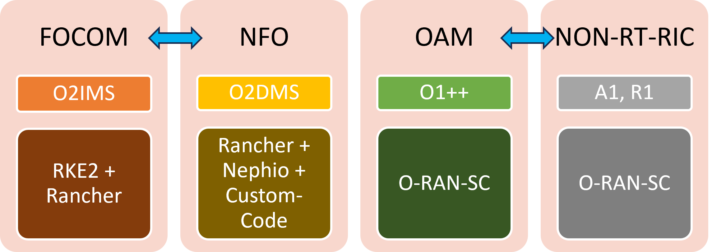
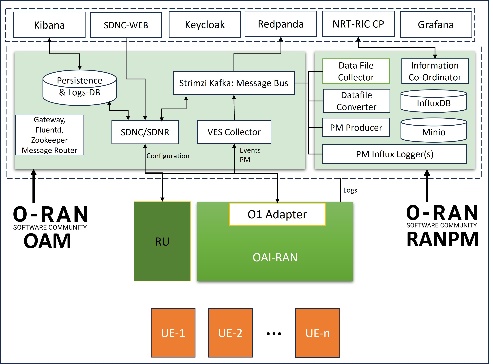

.. This work is licensed under a Creative Commons Attribution 4.0 International License.
.. SPDX-License-Identifier: CC-BY-4.0
.. Copyright (C) 2024 IOSMCN

IOS-MCN User-Experience
=======================

This document describes the experience of IOSMCN project in using O-RAN-SC solutions. This document refers to the work done for the first (Agartala) release of IOSMCN.

About IOSMCN
------------
The Indian Open-Source Software Platform for end-to-end Mobile Communication Networks (IOS-MCN) will accelerate the development and deployment of Mobile Communication (5G/6G) products and services by the vendors.

It is a collaboration between academia, government, and the Indian Telecom Ecosystem (vendors, service providers, companies, and startups) to leverage the global open-source ecosystem and establish a common forum for open source technology projects and solutions from India, by India.

The IOS-MCN Consortium provides a neutral, democratic, and trusted platform for the translation of 5G/6G innovation and research into commercially deployable Open Source software.

About the Work
--------------
The work is about adding SMO solution for IOS-MCN based on open-sources. The below figure shows the scope of the work. SMO of IOSMCN provides the following:

- Automated deployment of Kubernetes Cluster and Docker Environment
- Automated Deployment of RAN, Core and OAM Components.
- Configuration of RAN and Core through GUI.
- Visualization of Performance metrics, Faults and Logs.

The first release of IOS-MCN mostly cover the OAM component of the SMO.

The OAM Architecture
--------------------

The overall OAM architecture of IOS-MCN is shown below.

The OAM component interacts with gNB based on OAI and the corresponding O1-adapter, over the O1 interface.

Experience
----------
We will describe the experience - in terms of lessons learnt, challenges faced, choosing right solution among the available alternatives, etc, - for each of the individual components one by one.

SDN-Controller based configuration of RAN
~~~~~~~~~~~~~~~~~~~~~~~~~~~~~~~~~~~~~~~~~
The project initially explored the light-weight configuration solution for RAN. Developing a custom Netconf client application is not a challenge, However, features such as additional features such as message-handling, topology management, and inventory, which are already part of an SDN controller, makes a strong case for SDN-Controller based solution. In addition, all available open-source RAN configuration solutions are SDN-based (we couldn't find what solution srsRAN is using).

Alternatives:
#############
1. ONAP's SDNC and SDNC-Web - part of O-RAN-SC's OAM.
2. ONOS-Config
3. OpenMPlane (For RU configuration).

ONOS-Config is based on gNMI, and lacked Netconf Support. Converting from gNMI to Netconf adds additional work. Hence we decided to use SDNC/R (ODL) from o-ran-sc/oam.

We will be exploring OpenMplane for the next release of IOS-MCN.

Design Decisions
################

1. Use persistency of not, and if yes, which one?. We decided to use persistency and stick with Elasticsearch, at least for the first release. The community has moved to MongoDB, due to uncertainties over Elastic remaining opensource, and we may eventually make the move to MongoDB.
2. We decided to reuse the elasticsearch database for our logging needs. The same persistency database of SDNC is used for logging in IOSMCN.

Challenges:
###########

1. Currently, the SDNC-Web's configuration application has lot of issues in processing the configuration (get configuration) and also while making the actual changes to the configurable parameters. This is the only drawback, and a major one, of the O-RAN-SC's OAM solution. Unless this issue is fixed or an alternative solution is created, the OAM solution will not find many takers.
2. Picking the right versions of Elasticserach and Kibana, which will also work with Fluentd is not so straightforward.
3. Controller, for the first time may fail to start within the timeout period - mainly due to interactions with the elastic search. We ended up restarting the container most of the times. The most recent version that we could get it working is 7.17.24.

Tips:
#####

1. Ensure you are subscribing for right messages (Kafka topics) using 'topic' parameters - refer to configuration in `Mountpoint Properties <https://github.com/o-ran-sc/oam/blob/master/solution/smo/oam/controller/mountpoint-registrar.properties>`_

2. In the same file, ensure your kafka deployment name is correct under "bootstrapServers" parameter.
3. Important environment variables:

    i. SDNR_VES_COLLECTOR_IP and PORT.
    ii. SDNR_VES_COLLECTOR_USERNAME and PASSWORD
    iii. SDNRDBURL
4. If you have to build sdnc and sdnc-web images, use the `sdnc-oam repo <https://github.com/onap/sdnc-oam>`_

VES-Collector
~~~~~~~~~~~~~

VES collector is one of the critical components of OAM. As it performs validation of the messages/events against the schema, and in a particular way, it becomes very important to understand the integration with this component.

Alternatives:
#############
1. VES-Collector from ONAP - which is used by the O-RAN-SC's OAM project.
2. VES-Collector from the O-RAN-SC's SMO project.

The VES-Collector from smo-ves is not actively maintained. Hence, we decided to use the VES-Collector from ONAP, which is part of O-RAN-SC's OAM project.

Design Decisions
################

1. Do we even need VES collector? Without the VES collector, the burden of mapping message (stream-id) to kafka topics has to be borne by somebody else - probably the O1-adapter. If this, moving the burden to somebody else, is not possible, then we do need VES collector.
2. Do we need validation by VES collector? This we MAY not need and just a component that maps messages to topics should be enough. We will be experimenting by creating a simple HTTP server-cum-client, which receives messages from RAN components, parses the header, and calls Kafka-bridge's APIs.

Challenges:
###########

1. Upgrading to newer version (1.12.5) is a challenge - it doesn't work. The most recent version we can use is 1.12.4.
2. Understanding how ves-collector maps the message to the topic is not clear from the configurations. We will have to look at multiple-files to undestand. `ves-dmaap-config.json <https://github.com/o-ran-sc/oam/blob/master/solution/smo/oam/ves-collector/ves-dmaap-config.json>`_ maps topics to a key(streamid). This key is further mapped to message type in `collector.properties <https://github.com/o-ran-sc/oam/blob/master/solution/smo/oam/ves-collector/collector.properties>`_ file. Here the message type is read from either domain-name or standard-defined name.
3. It doesn't work with kafka-bridge directly, we are yet to figure out what changes should be made to remove the dependency with DMAAP-MR. Thought DMAAP-MR is been deprecated, the ves-collector still has some strange dependencies on it.

Tips:
#####

1. Ensure you have right configuration of DMAAP_HOST. The same should be use in `ves-dmaap-config.json <https://github.com/o-ran-sc/oam/blob/master/solution/smo/oam/ves-collector/ves-dmaap-config.json>`_ under topic_url variable
2. You may have to modify `externalrepo.json <https://github.com/o-ran-sc/oam/blob/master/solution/smo/oam/ves-collector/externalRepo.json>`_ to ensure you have Rel-18. Delete lines 6-10.
3. If you want to test your ves-collector with the accompanying `client code <https://github.com/o-ran-sc/oam/blob/master/code/client-scripts-ves-v7/>`_ then you will have to unde the json templates present in the client code.

Message Router
~~~~~~~~~~~~~~

Alternatives:
#############
1. DMAAP-MR (not actively developed)
2. Kafka Bridge.

As we could not complete the testing of kafka bridge with VES-Collector, at least for the first release, we are sticking with the deprecated DMAAP-MR. Even O-RAN-SC OAM is using the dmaap-mr as the messge router. We will eventually migrate to kafka-bridge. We will update here 

Design Decisions
################
None

Challenges:
###########

1. DMAAP-MR is deprecated. Even building locally fails. We just have to use the published containers.

Tips:
#####

1. Try with kafka-bridge from the beginning.

Performance Management: Handling File-Ready
~~~~~~~~~~~~~~~~~~~~~~~~~~~~~~~~~~~~~~~~~~~

gNB puts all the performance metrics for a certain time-window in a file, and sends file-ready event O1 interface. The OAM when it receives this event, it pulls the file from gNB, and how it handles that file can vary across different solutions. For example, in O-RAN-SC Non-RT RIC ranpm project, the file is first put into minio-db, next converted to json, and finally added to influxDB as individual metrics.

Alternatives:
#############

1. O-RAN-SC NON-RT-RIC's ranpm project.
2. Customize the smo-ves project to handle file-ready event.

We tried both the options, including developing a custom solution based on smo-ves, and finally opted to use it ranpm.

Design Decisions
################

1. Monolith vs microservices: File-ready handling based on RANPM solution requires deploying 8 different components. We developed a single component, based on O-RAN-SC smo-ves to pull the file, convert it to json and add metrics to influxDB. After detailed evaluation, prioritizing flexibility and future use-cases, we chose to use ranpm's microservices architecture.

Challenges:
###########

1. Existing ranpm solution expects the file-ready message in a `format <https://docs.onap.org/projects/onap-vnfrqts-requirements/en/latest/Chapter8/ves_7_2/ves_event_listener_7_2.html#notification-domain-datatypes>`_, which is quite different from the way OAI (3GPP_Performance_Assurance) sends. We had to modify significantly the existing datafile-collector to support the newer version.

2. Adding PM-Producer jobs for Logger's consumption: Currently, it requires to run a certain script, in order for PM-Producer to send metrics, which can be consumed by the PM-Logger. In this script, we canno create a 'generic' filter (refer to JSON code below). We need to put specific (matching the deployment) values in one or more fields

..
.. code-block:: JSON

    {
       "info_type_id": "PmData",
       "job_owner": "console",
       "job_definition": {
          "filter": {
             "sourceNames": ["gnB Eurecom"],
             "measObjInstIds": [],
             "measTypeSpecs": [
                {
                   "measuredObjClass":"",
                   "measTypes": []
                }
             ],
             "measuredEntityDns": []
          },
          "deliveryInfo": {
             "topic": "pmreports",
             "bootStrapServers": "kafka-1:9097"
          }
       }
    }

3. Bloating of the file-converter application: The pm-file-converter, a golang application, which coverts xml-to-json bloats over a period of time. If it is left running for a week, it bloats so big that it ends up crashing. This issue has been notified to the Non-RT-RIC team and they are looking into this.

Tips:
#####

1. Track the minio-databases if you face any issue.
2. Document and keep track of the topics that are being used. Especially the topics used by pm-producer - for example, json-file-ready-kpadp does not get used.

Demonstration Details
~~~~~~~~~~~~~~~~~~~~~

1. `Introduction Slides <https://docs.google.com/presentation/d/1l5Y1VQdiN6-1u-UPiN6EQMY3I8UdCrC2/edit>`_
2. `Demo-Video <https://drive.google.com/file/d/1mp59JT_KOnv-NRmj5CbgfTBzDsPgRnjk/view?usp=drive_link>`_

User Contact for IOS-MCN
~~~~~~~~~~~~~~~~~~~~~~~~

Name: Sridhar K. N. Rao

email: sridharkn@u.nus.edu
